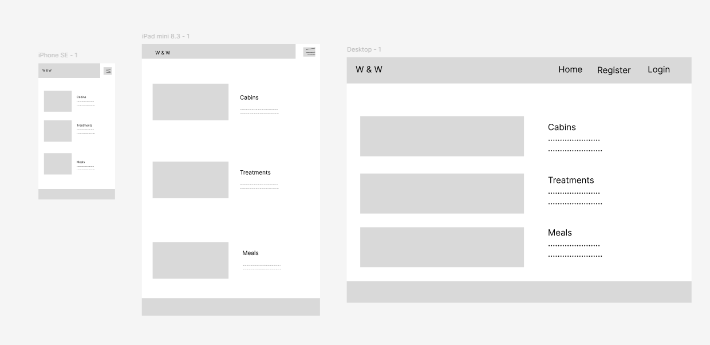
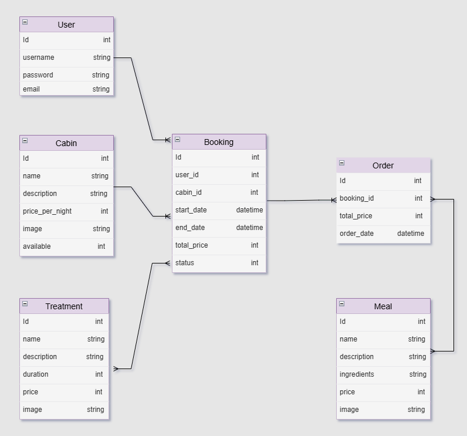

# **Wild Wellness**

[Project live link]()

## Contents

* [User Experience (UX)](#user-experience-ux) 
* [Features](#features)
* [Design](#design)
* [Libraries and Programs](#libraries-and-programs)
* [Technologies Used](#technologies-used)
* [Testing](#testing)
* [Deployment](#deployment)
* [Credits](#credits)

## User Experience (UX)

- ### User Stories

    #### 1. 

    

    #### 2. 

  

    #### 3. 

    #### 4. 

    
    #### 5. 

   

    #### 6. 

- ### Wireframes

- ### ERD Diagram

## Features

### Existing Features

####  **Main Screen**

####  ** **

 

####  ** **

####  ** **

#### ** **

#### ** **

 

#### ** **

#### ** **

### Future Features:

- 
- 
- 
- 

## Design

- 

## Libraries and Programs

-  Gitpod
    - The development environment where the project was created and tested.
-  [GitHub](https://github.com/Magda-R-bit)
    - Repository hosting service used for version control.
-  [Heroku](https://help.heroku.com/)
    - Cloud platform where project was deployed.

## Technologies

### Language

-    [Python](https://en.wikipedia.org/wiki/Python_(programming_language))

## Testing
  
### Manual Tests and Results

* Testing completed on the below browser:
  - Chrome
  - Edge
  - FireFox
  - DuckDuckGo

### Validation

- [HTML Validator]()

- [CSS Validator]()

- Lighthouse Testing

## Bugs

### Unfixed Bugs

* No unfixed bugs.

## Deployment

### Version Control

* The project was developed using the [Code Institute Template](https://github.com/Code-Institute-Org/p3-template), the Gitpod editor, and was pushed to GitHub in the remote repository Wild-Wellness.
* Git commands were used to push the code to the repository.

### Deployment to Heroku

* The project was deployed to Heroku with the following steps:
  - Create an account and log in to Heroku
  - Go to the dashboard, click *New*, then *Create new app*
  - Navigate to *Settings*
  - Go to *Config Vars*, click *Reveal Config Vars*, and add the KEY, and the VALUE. Click *add*
  - Go to *Buildpacks*, then click *Add buildpack*, in the following order:
    - Select *python* and click *Add Buildpack*
    - Select *nodejs* and click *Add Buildpack*
  - Navigate to the *Deploy* tab at the top
  - Click *GitHub*, then *Connect to GitHub*
  - Search for the repository you want to deploy and click *connect*
  - Select *Enable Automatic Deploys* or *Deploy Branch*

[Link to deployed project]()

### How to clone the repository

- Go to the https://github.com/Magda-R-bit/Chef_Secret_Recipes reposotory on GitHub
- Click on the Code button located above the project files
- Select HTTPS and copy the repository link
- Open your IDE, and paste the copied Git URL into the IDE terminal
- The project is now created as a local clone

## Credits

 - **Special Thanks**:
   - **Spencer Barriball**- For your mentorship. Your insights and advices were crucial to the success of this project.

### Inspiration

- [w3schools](https://www.w3schools.com/howto/howto_css_modals.asp)
- [stackoverflow](https://stackoverflow.com/)
- [I Think Therefore I Blog Walkthrough Project](https://github.com/Magda-R-bit/django-blog)
- [Dee Mc](https://www.youtube.com/watch?v=sBjbty691eI&list=PLXuTq6OsqZjbCSfiLNb2f1FOs8viArjWy&index=1)
- Antonio Melé: "Django 5 By Example"
